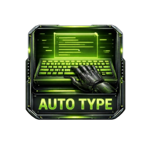

<div align="center">



# OpenRoadTyper — Autotype Terminal

**Type text into any window that won't let you paste.**


</div>

---

Some fields just refuse pasted text — legacy terminals, remote KVMs, kiosk
apps, certain login prompts, form fields with paste blocked "for security."
**OpenRoadTyper** doesn't fight them. It waits for a countdown, then
simulates real keystrokes straight into whatever window has focus — the
same way a human typing very fast would.

Write (or dictate) the text once, hit **Start**, switch to the target
window during the countdown, and watch it type itself.

- ⌨️ **Real keystroke simulation** — not clipboard tricks, actual synthetic
  key events, so it works anywhere typing works.
- 🎙️ **Voice dictation** — speak the text instead of typing it (German/English).
- ⏱️ **Configurable countdown & typing speed** — from "as fast as possible"
  to a deliberately human pace.
- 💾 **Draft persistence** — your text survives an app restart.
- 🐧🪟 **Native on Windows and Ubuntu Linux** — same features, same look,
  one codebase.

---

## Contents

- [Quick start](#quick-start)
- [How it works](#how-it-works)
- [Project layout](#project-layout)
- [What changed for Linux, and why](#what-changed-for-linux-and-why)
- [Ubuntu: requirements & build](#ubuntu-requirements)
- [Windows: requirements & build](#windows-requirements)
- [Feature parity checklist](#feature-parity-checklist)
- [Known platform-specific limitations](#known-platform-specific-limitations)

---

## Quick start

**Ubuntu:**

```bash
sudo apt install xdotool        # keyboard-injection backend (auto-detected)
dotnet run --project OpenRoadTyper.Avalonia/OpenRoadTyper.Avalonia.csproj
```

**Windows:**

```powershell
dotnet run --project OpenRoadTyper.Windows\OpenRoadTyper.csproj
```

That's it — type your text, set a delay, click **Start**, click into the
target window before the countdown hits zero. Full requirements, standalone
builds, and voice-dictation setup below.

---

## How it works

```
┌─────────────────────┐        ┌──────────────────────┐
│   OpenRoadTyper UI   │  Start │  Countdown (N sec)    │
│  (your prepared text)│ ─────▶ │  → switch focus now → │
└─────────────────────┘        └───────────┬───────────┘
                                            │
                                 IKeyboardInputService
                                            │
                        ┌───────────────────┴───────────────────┐
                        │                                        │
                 Windows: SendInput                    Linux: auto-detected
                 (user32.dll, real                      backend
                  synthetic key events)                       │
                                              ┌─────────────────┴─────────────────┐
                                     $DISPLAY set (X11/XWayland)      no $DISPLAY (pure Wayland)
                                        → xdotool (preferred)             → ydotool (uinput + daemon)
```

Every keystroke is a real synthetic input event delivered to whatever
window currently has OS focus — the app has no idea what that window is,
which is exactly what lets it work with terminals, remote sessions, and
paste-blocked fields alike.

## Project layout

```
OpenRoadTyper.Core/        Cross-platform class library (net10.0). Shared
                            logic + interfaces (IKeyboardInputService,
                            ISpeechRecognitionService, IShortcutInstaller),
                            plus both platforms' implementations, isolated
                            in PlatformWindows/ and PlatformLinux/. Selected
                            at runtime by the single PlatformFactory choke
                            point - no OS checks anywhere else.
OpenRoadTyper.Windows/      The original Windows Forms app (net10.0-windows).
                            Unchanged in spirit/behavior - still Windows-only,
                            still uses System.Windows.Forms/System.Drawing/
                            System.Speech - just wired to Core's interfaces
                            instead of embedding platform code directly.
OpenRoadTyper.Avalonia/     The new cross-platform GUI (net10.0, Avalonia
                            UI). This is what you run on Ubuntu; it also
                            runs on Windows from the same codebase.
Tastatur-Tool.sln           Solution file referencing all three projects.
```

Both apps share the exact same core behavior (typing timing, draft
persistence, delay/typing-speed settings, dictation) through
`OpenRoadTyper.Core` - only the GUI toolkit and the low-level "type a
key"/"listen to the mic"/"create a launcher icon" implementations differ
per OS.

## What changed for Linux, and why

Windows Forms has no Linux implementation, so the GUI itself was ported to
[Avalonia UI](https://avaloniaui.net/) (`OpenRoadTyper.Avalonia`), a
mature, XAML-based, truly cross-platform .NET UI framework. It keeps the
app's dark "terminal/road" visual identity (same color palette, same
panel/section layout, same controls and workflow) while using Avalonia's
own rendering instead of GDI+.

Everything else that was Windows-specific got a real Linux counterpart
instead of being removed:

| Concern | Windows | Linux |
|---|---|---|
| Simulated keyboard input | `user32.dll` `SendInput` (P/Invoke) | Auto-detects and shells out to `xdotool` (X11/XWayland) or `ydotool` (Wayland via uinput) - whichever actually matches the running session - since no display server exposes a `SendInput` equivalent directly to apps |
| Speech recognition | Built-in `System.Speech`/SAPI | Offline [Vosk](https://alphacephei.com/vosk/) speech engine + microphone capture via `pw-record`/`parecord`/`arecord` (whichever is present) |
| Clipboard | `System.Windows.Forms.Clipboard` | Avalonia's cross-platform clipboard API (backed by the desktop's own clipboard mechanism) |
| Desktop shortcut/launcher icon | `.lnk` file via the `WScript.Shell` COM object | `.desktop` entry in `~/.local/share/applications` (shows up in the app menu/launcher) with a proper icon, mirrored onto `~/Desktop` if present |
| Draft text persistence | `%AppData%\OpenRoadTyper\draft.txt` | `~/.config/OpenRoadTyper/draft.txt` (same `Environment.SpecialFolder.ApplicationData` API - .NET already maps it correctly per OS) |

No feature was cut to make Linux support easier. The one genuine
platform asymmetry - Windows ships a speech engine out of the box, Linux
doesn't - is handled the same way SAPI itself is handled: the feature
works once the "language pack" (here, a Vosk model) is installed. See
[Speech recognition on Linux](#speech-recognition-on-linux-optional) below.

---

## Ubuntu: requirements

- **.NET SDK 8.0 or newer** (developed/tested against .NET 10):
  ```bash
  wget https://dot.net/v1/dotnet-install.sh -O dotnet-install.sh
  chmod +x dotnet-install.sh
  ./dotnet-install.sh --channel LTS
  # or, on recent Ubuntu releases:
  sudo apt update && sudo apt install dotnet-sdk-8.0
  ```
- **`xdotool`** or **`ydotool`** - required for the "type the text into
  the focused window" feature. The app detects at runtime which one is
  installed and picks the backend that actually matches your session -
  you don't need to configure anything, just install one of them:
  ```bash
  sudo apt install xdotool
  ```
  `xdotool` works out of the box on X11 sessions and on Wayland sessions
  where XWayland is running (the common case - true on GNOME/Mutter,
  KDE/Plasma, and most desktop setups; check with `echo $DISPLAY`, a
  non-empty value means XWayland is available). It's the recommended
  choice whenever it applies: no background service to keep running.

  For a pure-Wayland session with **no** XWayland (`$DISPLAY` empty -
  some minimal wlroots-based compositors), install `ydotool` instead and
  make sure its daemon is running:
  ```bash
  sudo apt install ydotool
  sudo systemctl enable --now ydotool
  ```
  If both are installed, the app prefers `xdotool` whenever `$DISPLAY`
  is set and only falls back to `ydotool` otherwise. If `ydotool` still
  fails with a "failed to connect socket" error, `ydotoold` isn't
  reachable at the socket path `ydotool` expects - restart the service
  above, or set `YDOTOOL_SOCKET` to match where it's actually listening.

  Neither tool installed? The app fails fast with a clear message
  *before* the countdown starts, naming exactly what to install for your
  session - it no longer makes you wait through the countdown first.
- **An audio recorder** for voice dictation - Ubuntu ships one by
  default (`pw-record` with PipeWire on 22.04+, or `arecord` from
  `alsa-utils`). If neither is present:
  ```bash
  sudo apt install pipewire-bin   # or: sudo apt install alsa-utils
  ```
- Fonts/rendering libraries used by Avalonia (`libfontconfig1`,
  `libx11-6`) are part of any standard Ubuntu desktop install already.

### Build on Ubuntu

```bash
dotnet restore
dotnet build OpenRoadTyper.Avalonia/OpenRoadTyper.Avalonia.csproj -c Release
```

(`dotnet restore`/`dotnet build` with no project argument from the repo
root builds every project in the solution, including the Windows-only
one - see [Cross-building the Windows app from Linux](#cross-building-the-windows-app-from-linux-optional).)

### Run on Ubuntu

```bash
dotnet run --project OpenRoadTyper.Avalonia/OpenRoadTyper.Avalonia.csproj
```

### Publish a standalone build for Ubuntu

Produces a self-contained folder that runs on any x64 Ubuntu machine
without a separately installed .NET runtime:

```bash
dotnet publish OpenRoadTyper.Avalonia/OpenRoadTyper.Avalonia.csproj \
  -c Release -r linux-x64 --self-contained true \
  -p:PublishSingleFile=true -o dist/linux-x64
```

Run it with `./dist/linux-x64/OpenRoadTyper`. `xdotool`/`ydotool` and an
audio recorder are still expected to be installed on the target machine
(they are system tools, not .NET libraries, so they aren't bundled).

### Speech recognition on Linux (optional)

Voice dictation needs a local [Vosk](https://alphacephei.com/vosk/models)
model - Vosk is fully offline, so nothing is ever sent over the network,
but the model itself (tens of MB) isn't bundled with the app, the same
way Windows requires the matching SAPI speech-recognition language pack
to already be installed. Steps:

1. Download a model, e.g. `vosk-model-small-de-0.15` (German) or
   `vosk-model-small-en-us-0.15` (English) from
   <https://alphacephei.com/vosk/models>.
2. Unpack it so its contents (the `am/`, `conf/`, `graph/`, ... folders)
   live directly under:
   ```
   ~/.local/share/OpenRoadTyper/speech-models/de/   (for German)
   ~/.local/share/OpenRoadTyper/speech-models/en/   (for English)
   ```
3. Start the app and click the microphone button. If a model is
   missing, the status panel explains which one and where it's expected
   (you can also point at a different location via the
   `OPENROADTYPER_VOSK_MODEL_DE` / `OPENROADTYPER_VOSK_MODEL_EN`
   environment variables).

Without a model installed, every other feature of the app works
normally - only dictation is unavailable, exactly like a fresh Windows
install with no speech language pack.

---

## Windows: requirements

- **.NET SDK 8.0 or newer** (get it from
  <https://dotnet.microsoft.com/download>, or `winget install Microsoft.DotNet.SDK.8`).
- No other runtime dependencies - `System.Speech` (dictation) and the
  desktop shortcut feature use APIs already built into Windows.

### Build on Windows

```powershell
dotnet restore
dotnet build OpenRoadTyper.Windows\OpenRoadTyper.csproj -c Release
```

This is the original Windows Forms app, unchanged in behavior. (You can
also open `Tastatur-Tool.sln` in Visual Studio 2022+ and build from
there.)

### Run on Windows

```powershell
dotnet run --project OpenRoadTyper.Windows\OpenRoadTyper.csproj
```

Or run the built executable directly:
`OpenRoadTyper.Windows\bin\Release\net10.0-windows\OpenRoadTyper.exe`.

The cross-platform Avalonia build also runs on Windows, from the same
codebase used for Ubuntu:

```powershell
dotnet run --project OpenRoadTyper.Avalonia\OpenRoadTyper.Avalonia.csproj
```

### Publish a standalone build for Windows

```powershell
dotnet publish OpenRoadTyper.Windows\OpenRoadTyper.csproj `
  -c Release -r win-x64 --self-contained true `
  -p:PublishSingleFile=true -o dist\win-x64
```

This produces `dist\win-x64\OpenRoadTyper.exe`, runnable on any x64
Windows machine without a separately installed .NET runtime.

### Cross-building the Windows app from Linux (optional)

`OpenRoadTyper.Windows.csproj` sets `EnableWindowsTargeting`, so
`dotnet build`/`dotnet publish -r win-x64` for it succeed from a Linux
machine or CI runner too (useful for verifying the Windows build hasn't
broken without needing a Windows box) - the NuGet-restored Windows
reference assemblies are enough to compile and cross-publish a working
`.exe`. Actually **running** it still requires Windows, of course.

---

## Feature parity checklist

Everything the original Windows Forms app did is present on both
platforms:

- ✅ Multi-line text editor with live character count and persisted draft
  (survives app restarts).
- ✅ Configurable start countdown (+/- stepper and 3s/5s/10s/15s presets).
- ✅ Configurable typing interval (0 = as fast as possible), switchable
  between seconds and milliseconds.
- ✅ "Minimize window on start" and "use Enter key for newlines" options.
- ✅ Paste-from-clipboard and clear-text actions.
- ✅ Voice dictation with a language toggle (German/English), appending
  recognized speech to the text with punctuation-aware spacing.
- ✅ Start/cancel with a live countdown and status panel.
- ✅ A first-run launcher shortcut (desktop icon on Windows, app-menu entry
  + desktop icon on Linux).

## Known platform-specific limitations

- **Linux keyboard injection depends on `xdotool`/`ydotool` being
  installed** (see [requirements](#ubuntu-requirements) above) - there is
  no OS-level equivalent of Windows' `SendInput` that a sandboxed desktop
  app can call directly on Linux; shelling out to the standard tool is
  the same approach every Linux automation/RPA tool uses. The app
  auto-detects whichever of the two is installed and best-suited to the
  current session (preferring `xdotool` whenever `$DISPLAY` is set,
  `ydotool` otherwise) - nothing to configure by hand. Wayland
  compositors that don't provide XWayland and don't run `ydotoold` won't
  be able to receive simulated keystrokes at all - this is a Wayland
  security boundary, not a bug in the app; the FAILSAFE message names
  exactly which tool to install for your session, and shows up
  immediately on Start rather than after the countdown.
- **Speech recognition on Linux requires a downloaded Vosk model** (see
  [above](#speech-recognition-on-linux-optional)); Windows uses the
  speech engine already built into the OS.

---

<div align="center">

Built with ❤️ and a suspicious number of `Process.Start` calls.

</div>
